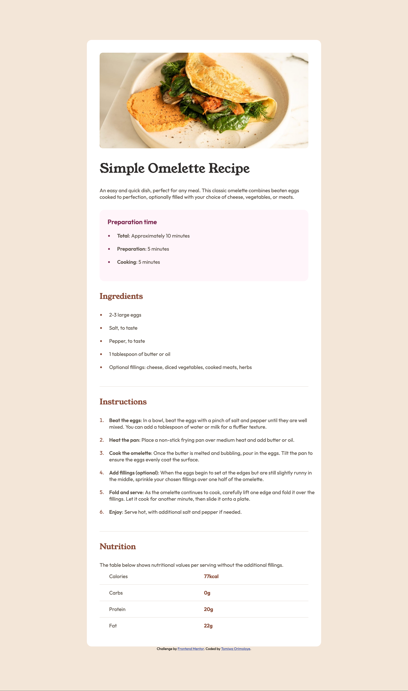

# Frontend Mentor - Recipe page solution

This is a solution to the [Recipe page challenge on Frontend Mentor](https://www.frontendmentor.io/challenges/recipe-page-KiTsR8QQKm).

## Table of contents

- [Overview](#overview)
  - [Screenshot](#screenshot)
  - [Links](#links)
- [My process](#my-process)
  - [Built with](#built-with)
  - [What I learned](#what-i-learned)
  - [Continued development](#continued-development)
- [Author](#author)


## Overview

### Screenshot


### Links

- Solution URL: [Add solution URL here](https://your-solution-url.com)
- Live Site URL: [Add live site URL here](https://your-live-site-url.com)

## My Process

### Built with

- Semantic HTML5 markup
- CSS custom properties
- Flexbox

### What I learned
I learnt how to use the root selector and css variables.

```css
:root {
  font-size: 16px;
  /* Colors */

  /* Primary */
  --nutmeg: hsl(14, 45%, 36%);
  --dark-raspberry: hsl(332, 51%, 32%);

  /* Neutral */
  --white: hsl(0, 0%, 100%);
  --rose-white: hsl(330, 100%, 98%);
  --eggshell: hsl(30, 54%, 90%);
  --light-grey: hsl(30, 18%, 87%);
  --wenge-brown: hsl(30, 10%, 34%);
  --dark-charcoal: hsl(24, 5%, 18%);
}
```
### Continued development

Use this section to outline areas that you want to continue focusing on in future projects. These could be concepts you're still not completely comfortable with or techniques you found useful that you want to refine and perfect.

## Author

- Website - [Github](https://github.com/tomiwaorimoloye)
- Frontend Mentor - [@tomiwaorimoloye](https://www.frontendmentor.io/profile/tomiwaorimoloye)